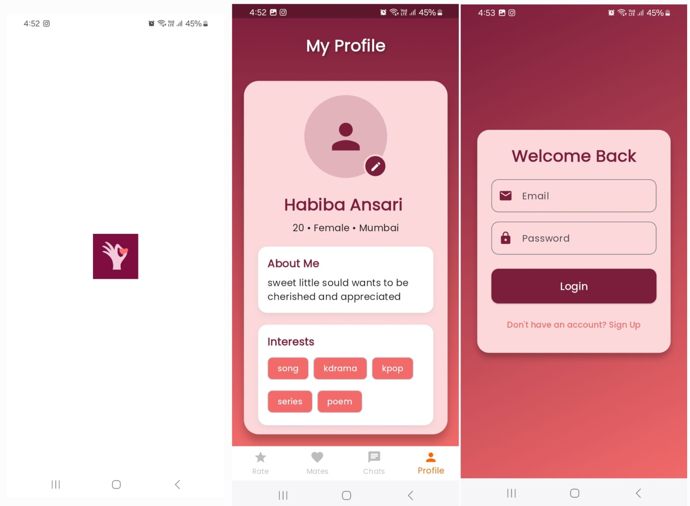

# RateMate

RateMate is a next-gen dating app built with **Flutter** and **Firebase**, combining anonymous ratings with smart matchmaking. Users can rate profiles, improve their own, and discover compatible matches through a fun, interactive experience.  





---

## **Features**

### 1. Profile Creation & Editing
- Create a detailed profile with photos, bio, and interests.
- Edit and update profiles anytime.

### 2. Rate Page
- Browse other profiles anonymously.
- Slider-based rating system (1–10 scale).
- Individual ratings remain secret; only averages are stored internally.

### 3. Mate Page (Matching)
- Shows potential matches based on rating averages.
- Users see profiles with similar rating levels.
- Ratings of others remain hidden.

### 4. Chatting Feature
- In-app chat with:
  - Text messages
  - Photos
  - Audio clips
- Safe and secure communication.

### 5. Rating-Driven Profile Improvement
- Improve profiles based on anonymous feedback.
- Gamified profile optimization for better matches.

---

## **Tech Stack**

- **Frontend:** Flutter  
- **Backend & Database:** Firebase Firestore  
- **Authentication:** Firebase Auth  
- **Storage:** Firebase Storage (for images & audio)  
- **Realtime Updates:** Firebase Firestore & Cloud Messaging  

---

## **Screens & Flow**

1. **Sign Up & Build Profile**
2. **Rate Other Profiles**
3. **View Mate Page for Matching**
4. **Chat with Matches**
5. **Improve Profile Based on Feedback**

---

## **Installation**

1. Clone the repository:  
```bash
git clone https://github.com/yourusername/ratemate.git
cd ratemate
flutter pub get
flutter run
